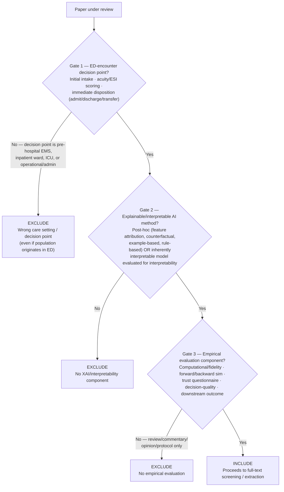

# Inclusion Boundary — Emergency Department XAI Scoping Review (EM-Only Scope)

**Issue:** #7
**Status:** Revised 2026-06-10 — rewritten for EM/ED-only scope per the pivot to the original proposal scope
**Applies to:** Title/abstract screening, full-text screening, extraction
**Decision log entries:** 2026-05-23 (original cross-domain version), 2026-06-10 (this revision)

---

## Decision Rule

A paper is within scope if it passes all three gates in sequence.

---

### Gate 1 — Emergency Department Encounter Scope

The predictive model's **decision point** occurs during the **initial ED encounter**, in one of three categories:

(a) **Initial patient intake** — e.g., chief-complaint screening, initial vitals-based risk flagging at ED arrival
(b) **Acuity / triage scoring** — e.g., ESI assignment, or an equivalent acuity scale (CTAS, MTS, ATS, etc. — not restricted to ESI)
(c) **Immediate disposition** — admit / discharge / transfer / ICU-admit decisions made *at the point of ED care*

**Exclude without further review:**
- **Pre-hospital / EMS triage models** — decision point occurs before ED arrival, even if patients are subsequently seen in the ED.
- **Inpatient ward deterioration/monitoring models** — decision point occurs after ward admission, even if the derivation/validation cohort was drawn from ED-admitted patients.
- **ICU-specific management, mortality, or prognosis models** — decision point occurs in the ICU, even if the population originates in the ED.
- **Operational/administrative ED models** (e.g., crowding, throughput, staffing prediction) — not a patient-level intake/acuity/disposition decision.
- **In-ED treatment/procedural/management decisions** (e.g., real-time resuscitation/CPR management, medication dosing, imaging acquisition/interpretation for diagnosis, physiologic monitoring during active care) — occurs during the ED encounter, on an ED patient, but is not intake, acuity/triage scoring, or immediate disposition. Gate 1's three categories (a)-(c) are exhaustive: an ED-encounter decision point that isn't one of the three named categories fails Gate 1, even with no other disqualifying signal (not EMS/inpatient/ICU/operational). Added 2026-07-03 after a recurring pattern in T/A borderline adjudication (e.g., AI predicting shockable rhythm during active CPR) — see `memos/decision_log.md`.
- **Patient-level predictions consumed administratively, not clinically** — a model may predict a Gate-1(c)-shaped outcome (e.g., admit vs. discharge) at the individual-patient level, but if the paper frames the output as being acted on by *administrators/systems* for capacity planning, staffing, or surge management — not returned to the treating clinician to inform that patient's own care — it fails Gate 1 on the same basis as the "operational/administrative ED models" exclusion above. The test is still the decision-point-vs-population-origin question (who acts on the output, and toward what end), not the granularity of the prediction target: a patient-level prediction aggregated/routed into an administrative capacity-management workflow is an operational use, not a clinical intake/acuity/disposition decision. Added 2026-07-03 after a recurring pattern in T/A borderline adjudication (e.g., ML+LLM model predicting individual ED disposition "before physician evaluation" explicitly to support hospital bed/staffing/surge management) — see `memos/decision_log.md`.

**Operational distinction for screeners — decision point vs. population origin:**

> Many models are derived or validated using ED-admitted patient cohorts but are intended to support a decision made *outside* the ED (e.g., a "30-day inpatient mortality" model used by the inpatient team after admission). The deciding question is always: **where and when is the model's output acted upon?** If the action is taken during the initial ED encounter — by ED staff, on an ED patient, before admission/discharge/transfer is finalized — Gate 1 passes. If the action is taken later, by a different team, in a different setting, Gate 1 fails, regardless of where the underlying data came from.
>
> Note that the *predicted outcome* may itself be a future event (e.g., 30-day readmission risk computed at ED discharge to inform the discharge decision itself) — this still passes Gate 1, because the **action point** is in the ED.

---

### Gate 2 — Explainable / Interpretable AI Method

The study applies, evaluates, or proposes:

- a **post-hoc explanation method** (feature attribution e.g. SHAP/LIME, counterfactual, example-based/case-based, rule-based/decision-rule extraction) applied to a predictive model for a Gate-1 decision, **or**
- an **inherently interpretable model** (e.g., logistic regression, decision tree, rule list) where the paper explicitly evaluates or discusses the model's interpretability as a contribution — not merely uses an interpretable model incidentally with no discussion of its interpretability.

**Exclude:** Studies of predictive models for Gate-1 decisions with **no interpretability/explanation component at all** (pure black-box performance papers).

---

### Gate 3 — Empirical Evaluation Component

The study reports at least one of the six evaluation levels from RQ2's taxonomy (`data/coding/eval_type_taxonomy.md`), **applied to the explanation method itself** (not only to the underlying predictive model's accuracy):

1. Computational / fidelity metrics (`ProxyMetric`)
2. Forward simulation (`ForwardSim`)
3. Backward simulation / counterfactual understanding (`BackwardSim`)
4. Trust questionnaire (`TrustQuestionnaire`)
5. Decision-quality study (`DecisionQuality`)
6. Downstream-outcome / real-world deployment evaluation (`DownstreamOutcome`)

**Exclude:** Review articles, editorials, commentaries, and opinion pieces with no underlying empirical study; protocol-only papers; conference abstracts without full proceedings.

---

## Decision Flowchart

---

## Edge Cases

| Paper type | Gate 1 | Gate 2 | Gate 3 | Decision | Rationale |
|------------|--------|--------|--------|----------|-----------|
| ED sepsis early-warning model with SHAP, used by ED physicians to decide immediate admission vs. discharge | Pass | Pass | Pass (clinician-in-the-loop) | **Include** | Standard case — decision point and action both in ED |
| ESI acuity-prediction model with attention-based explanation, evaluated via nurse usability study on simulated triage vignettes | Pass | Pass | Pass (simulated-user) | **Include** | Acuity scoring is a Gate-1 category; simulated study is a valid RQ2 evaluation level |
| Pre-hospital EMS stroke-triage model with counterfactual explanations, used by paramedics before ED arrival | Fail | — | — | **Exclude** | Decision point is pre-hospital/EMS, Gate 1 |
| Sepsis deterioration model with SHAP for inpatient ward monitoring; derivation cohort is ED-admitted patients | Fail | — | — | **Exclude** | Decision point is inpatient ward, not the initial ED encounter — population origin doesn't matter |
| ICU mortality-prediction model with LIME explanations, used for ICU triage after ED-to-ICU admission | Fail | — | — | **Exclude** | Decision point is ICU, Gate 1 |
| ED-discharge 30-day-readmission risk model with feature-attribution explanation, output reviewed by ED physician at the point of the discharge decision | Pass | Pass | Pass | **Include** | Action point (discharge decision) is in the ED even though the predicted outcome (readmission) occurs later |
| Pediatric febrile-infant ED risk-stratification tool using a decision-tree (rule-based) model, evaluated only via computational fidelity metrics, no clinician study | Pass | Pass | Pass (computational) | **Include** | Inherently interpretable model explicitly evaluated for interpretability; computational fidelity is a valid Gate-3/RQ2 evaluation level |
| Novel counterfactual-explanation method demonstrated on a general ICU dataset (e.g., MIMIC-III), no ED-specific framing | Fail | — | — | **Exclude** | Not an ED-encounter decision (MIMIC-III is ICU-derived) |
| Narrative review of XAI approaches for ED triage, no novel model or empirical evaluation | Pass | Pass (discusses methods) | Fail | **Exclude** | No empirical evaluation component, Gate 3; also excluded as a review article |
| ED crowding/throughput-prediction model (operational) with SHAP explanation for hospital administrators | Fail | — | — | **Exclude** | Not a patient-level intake/acuity/disposition decision — operational/administrative use case |
| ESI triage model with example-based (case-based) explanations, evaluated via clinician-in-the-loop study conducted in a simulation lab (not live ED workflow) | Pass | Pass | Pass | **Include** | All 3 gates pass; realism level (simulation vs. live deployment) is captured at extraction (EV/realism rubrics), not an exclusion criterion |
| Multi-setting study: same XAI-augmented sepsis model deployed and separately evaluated at ED triage, on inpatient wards, and in the ICU | Pass (ED-triage component only) | Pass | Pass | **Include (ED-triage component only)** | Extract only the ED-triage decision/evaluation; document the inpatient/ICU components as out-of-scope in `Notes`. If results are not reported separately by setting, escalate as a borderline case for adjudication |
| AI model predicting shockable rhythm from ECG during active CPR in the ED, with Grad-CAM explainability | Fail | — | — | **Exclude** | Population and setting are ED, but the decision point (real-time shock/no-shock during resuscitation) is a treatment/procedural decision, not intake, acuity/triage scoring, or immediate disposition — none of Gate 1's three categories |
| ML+LLM model predicting individual-patient ED disposition (admit vs. discharge) before physician evaluation, explicitly to give hospital administrators early notice for bed allocation/staffing/surge management, with SHAP explanation | Fail | — | — | **Exclude** | Prediction target is patient-level and disposition-shaped, but the output is consumed administratively (capacity/staffing planning), not returned to the treating clinician for that patient's own care — same action-point failure as the crowding/throughput exclusion, despite patient-level granularity |

---

## Operational Notes for Screeners

1. **Decision-point vs. population-origin (the central EM-scope distinction):** Always ask "where/when is the model's output acted upon?" — not "where did the data come from?" See the Gate 1 operational distinction above.
2. **Acuity scale terminology:** ESI is the proposal's reference example, but other acuity/triage scales used in non-US ED settings (CTAS, MTS, ATS, etc.) are in scope under the "acuity scoring" category.
3. **"Immediate disposition" scope:** Admit/discharge/transfer/ICU-admit decisions made *at* the point of ED care. Does **not** include downstream inpatient-team decisions made *after* the disposition decision itself.
4. **Gate 2 interpretable-model threshold:** A paper merely "using logistic regression" does not automatically pass Gate 2 — the paper must explicitly frame or evaluate interpretability as relevant, otherwise Gate 2 fails ("no XAI/interpretability component").
5. **Borderline cases:** Document in `memos/decision_log.md` with paper title and reasoning, per the project's standing convention. Per the proposal's specified workflow, borderline full-text cases are escalated to supervising faculty for adjudication (Issue #17).

---

## Registration Note

This boundary definition applies to the Population/Context and Eligibility Criteria sections of the OSF pre-registration (`docs/osf/preregistration_draft.md`). Per the 2026-06-10 pivot decision (`memos/decision_log.md`), PROSPERO registration (`docs/osf/prospero_draft.md`, Issue #19) is deprioritised — OSF is the registration record required by the project proposal.

---

## Version History

| Version | Date | Changes |
|---------|------|---------|
| v1 | 2026-05-23 | Initial 3-gate cross-domain inclusion rule (clinical domain / individual decision / clinician-in-loop). Issue #7. |
| v2 — EM-only | 2026-06-10 | Rewritten for EM/ED-only scope per pivot to the original proposal. New 3-gate rule: ED-encounter decision point (intake / ESI-acuity / immediate disposition, explicitly excluding EMS / inpatient / ICU / operational use cases) → explainable-or-interpretable AI method → empirical evaluation component. Cross-domain v1 retained in git history. |
| v2.1 | 2026-07-03 | Added explicit Gate 1 exclusion for in-ED treatment/procedural/management decisions (e.g., real-time CPR/resuscitation management) that occur during the ED encounter but are not intake, triage/acuity scoring, or disposition — clarifying that Gate 1's three categories are exhaustive, not merely "occurs in the ED." Added a matching edge-case table row. See `memos/decision_log.md`, 2026-07-03. |
| v2.2 | 2026-07-03 | Added explicit Gate 1 exclusion for patient-level predictions of a Gate-1(c)-shaped outcome (e.g., disposition) that are consumed administratively (capacity planning, staffing, surge management) rather than returned to the treating clinician — clarifying that the decision-point-vs-population-origin test turns on who acts on the output and toward what end, not the granularity of the prediction target. Added a matching edge-case table row. See `memos/decision_log.md`, 2026-07-03. |
