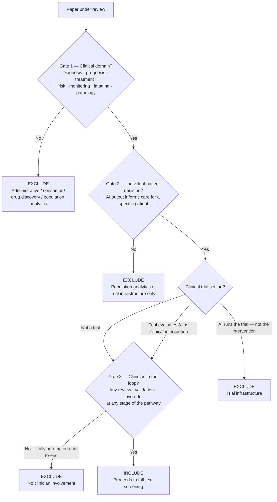

# Inclusion Boundary — Clinical vs Medical vs Healthcare AI

**Issue:** #7
**Status:** Resolved 2026-05-23
**Applies to:** Title/abstract screening, full-text screening, extraction
**Decision log entry:** 2026-05-23

---

## Decision Rule

A paper is within scope if it passes all three gates in sequence.

---

### Gate 1 — Clinical domain

The AI system operates in a clinical or medical domain: diagnosis, prognosis, treatment recommendation, risk stratification, patient monitoring, clinical image analysis, or pathology.

**Exclude without further review:**
- Administrative healthcare AI (scheduling, bed management, billing, coding, staffing optimisation)
- Consumer-facing health AI (fitness apps, wellness wearables) without clinical prescription or oversight
- Drug discovery or preclinical research AI (molecular screening, protein folding, biomarker discovery)
- Population-level public health analytics without individual patient decision output

---

### Gate 2 — Individual patient care decision

The AI output is used to inform a decision about an individual patient's care, diagnosis, treatment, or monitoring.

**Exclude:** AI used purely as clinical trial infrastructure — patient eligibility screening algorithms, randomisation engines, or endpoint prediction for trial management — unless the AI is itself the clinical intervention being evaluated.

**Clinical trial sub-rule:**
> Include if the trial evaluates the AI tool as a clinical decision support intervention delivered to clinicians for individual patient decisions.
> Exclude if AI is used to operate the trial (select participants, randomise, predict trial endpoints) but is not the intervention being studied.

---

### Gate 3 — Clinician in the loop

A clinician — physician, nurse, radiologist, pathologist, pharmacist, or equivalent licensed clinical professional — is involved at any stage of the decision pathway. Involvement includes: reviewing, validating, acting on, or retaining the right to override the AI output.

**Exclude:** Fully automated systems where no clinician sees, reviews, or can override the AI output at any point in the clinical pathway.

**Conditional include:** Asynchronous review qualifies. A clinician who reviews AI-flagged cases in batch (e.g., a radiologist reviewing AI-prioritised worklist) satisfies Gate 3 — real-time presence is not required.

---

## Decision Flowchart

---

## Edge Cases

| Paper type | Gate 1 | Gate 2 | Gate 3 | Decision | Rationale |
|------------|--------|--------|--------|----------|-----------|
| SHAP explanations for ICU mortality prediction, reviewed by intensivist | Pass | Pass | Pass | **Include** | Standard case |
| Automated diabetic retinopathy screening — ophthalmologist reviews AI-flagged cases in batch | Pass | Pass | Pass | **Include** | Asynchronous review satisfies Gate 3 |
| Automated diabetic retinopathy screening — results sent directly to patient, no physician review | Pass | Pass | Fail | **Exclude** | No clinician in loop at any stage |
| AI scheduling system for outpatient clinic | Fail | — | — | **Exclude** | Administrative, Gate 1 |
| Apple Watch AFib detection app | Fail | — | — | **Exclude** | Consumer-facing, no clinical oversight |
| AI for drug candidate screening | Fail | — | — | **Exclude** | Drug discovery, Gate 1 |
| NLP to extract trial eligibility from EHR — used only to select trial participants | Pass | Fail | — | **Exclude** | Trial infrastructure, Gate 2 sub-rule |
| RCT evaluating whether clinicians use AI risk scores to guide treatment decisions | Pass | Pass | Pass | **Include** | Trial evaluates AI as clinical intervention |
| Pathology image AI — pathologist confirms all results before report is issued | Pass | Pass | Pass | **Include** | Pathologist review satisfies Gate 3 |
| AI predicting hospital readmission — used only for population risk management, no individual clinical action taken | Pass | Fail | — | **Exclude** | No individual patient care decision, Gate 2 |
| AI-assisted drug dosing in ICU — physician reviews and approves every recommendation | Pass | Pass | Pass | **Include** | Standard clinical decision support |
| AI clinical documentation (NLP for ICD coding, discharge summary auto-fill) | Fail | — | — | **Exclude** | Administrative — coder, not clinician, acts on output |

---

## Operational Notes for Screeners

1. **Gate 3 uncertainty:** Check the Methods or Study Design section. If a physician, nurse, or other licensed clinician is described as reviewing or acting on AI output at any point, Gate 3 passes.
2. **Wearables and remote monitoring:** Pass Gate 1 only if device data feeds into a clinician-reviewed system (e.g., cardiac telemetry reviewed by a cardiologist). Consumer wellness devices fail Gate 1.
3. **Radiology AI with no radiologist review:** Apply the gate strictly — if no radiologist reviews the AI output before it affects patient care, fail Gate 3, regardless of regulatory clearance status.
4. **AI for clinical documentation:** Fails Gate 1 unless NLP output is reviewed by a clinician and directly informs a subsequent care decision. Coder review does not count as clinician-in-loop.
5. **Borderline cases:** Document in the decision log with paper title and reason. Do not leave borderline cases unrecorded.

---

## PROSPERO Protocol Note

This boundary definition applies to the Population and Eligibility Criteria sections of the PROSPERO registration. Update `docs/osf/prospero_draft.md` when the registration draft is written (Issue #8 or equivalent).
