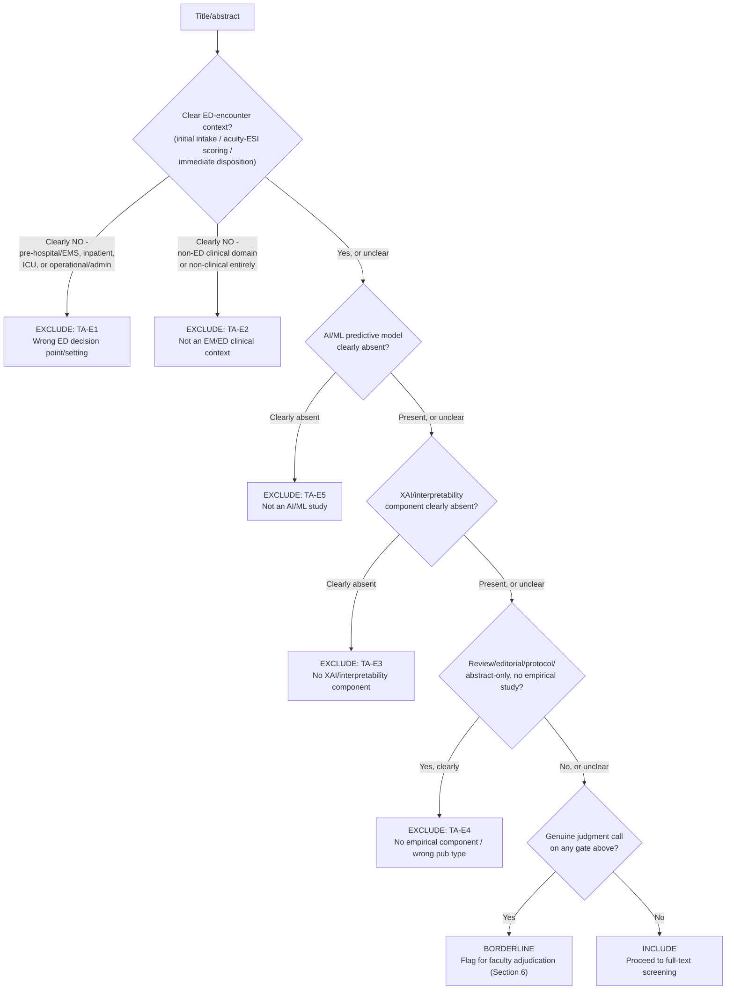

# Title/Abstract Screening Criteria

**Issue:** #17
**Status:** Draft
**Applies to:** Title/abstract screening stage (Rayyan), all sources (primary databases + supplementary, `docs/protocol/supplementary_search_plan.md`)
**Related:** `docs/protocol/inclusion_boundary.md` (v2), `docs/osf/preregistration_draft.md` Section 5, `memos/decision_log.md` (2026-06-10)

---

## 1. Purpose

This document specifies how the three-gate inclusion boundary (`docs/protocol/inclusion_boundary.md` v2) is applied at the **title/abstract (T/A) screening** stage, where information is incomplete and decisions must be made quickly across the full deduplicated corpus. It also specifies the inter-rater reliability (IRR) protocol for this stage, per the original proposal's design: a 15% random re-screen after a 2-week washout, intra-rater Cohen's kappa, and faculty adjudication for borderline cases.

This protocol is **distinct from** the full-text screening criteria (which apply the inclusion boundary's three gates in full, Section 7) and from the extraction-stage IRR protocol (two reviewers, 5-paper pilot, inter-rater kappa, `docs/osf/preregistration_draft.md` Section 8).

---

## 2. Screening Workflow

1. All deduplicated records (primary databases + supplementary sources, tagged per `docs/protocol/supplementary_search_plan.md`) are screened in Rayyan by a single reviewer.
2. For each record, the reviewer reads the title and abstract and applies the **conservative T/A-stage rule** (Section 3) to reach one of three decisions: **Include** (proceed to full-text), **Exclude** (with a reason code from Section 4), or **Borderline** (Section 6).
3. Decisions and reason codes are recorded as Rayyan labels on each record.
4. After T/A screening of the full corpus is complete, a 15% random sample is re-screened per the IRR protocol (Section 5).
5. Records marked **Include** or **Borderline** (after adjudication, Section 6) proceed to full-text screening (Section 7).

---

## 3. T/A-Stage Application of the Inclusion Boundary

Title and abstract text frequently does not contain enough detail to confidently apply all three gates of `docs/protocol/inclusion_boundary.md`. To avoid prematurely losing relevant studies, T/A screening uses a **sensitivity-favoring rule**:

> **When in doubt, include.** A record is excluded at T/A only when the title/abstract provides a **clear, positive indication** of a Gate 1, 2, or 3 failure (Section 4). If the abstract is ambiguous, ambiguous about XAI/interpretability methods, or simply too brief to assess a gate, the record is marked **Include** (or **Borderline** if the ambiguity is substantial enough to warrant a second opinion, Section 6) and deferred to full-text screening, where the full inclusion boundary is applied rigorously.

This mirrors the asymmetry in `docs/protocol/inclusion_boundary.md`'s own design: full-text screening is where the three gates are decisively applied; T/A screening's job is only to remove records that are *clearly* out of scope.

### Decision Tree

Each `EXCLUDE` leaf corresponds to a reason code in Section 4. The tree implements the sensitivity-favoring rule above: every "unclear" branch flows toward Include or Borderline, never toward Exclude.

---

## 4. EM-Specific T/A Exclusion Taxonomy

Each T/A exclusion is tagged with one of the following reason codes. Codes are aligned with the three gates of `docs/protocol/inclusion_boundary.md` v2 so that T/A exclusion patterns can be cross-checked against full-text exclusion patterns (Section 7) for consistency.

| Code | Label | Gate | Definition |
|------|-------|------|------------|
| `TA-E1` | Wrong ED decision point / care setting | Gate 1 | Title/abstract clearly indicates the decision point is pre-hospital/EMS triage, inpatient ward monitoring, ICU management, or ED operational/administrative (crowding, throughput, staffing) - not initial intake, acuity/triage scoring, or immediate disposition. |
| `TA-E2` | Not an EM/ED clinical context | Gate 1 | Title/abstract clearly indicates a non-ED clinical domain (e.g., radiology, oncology, primary care) with no ED-encounter framing - typically a search false-positive. |
| `TA-E3` | No XAI/interpretability component | Gate 2 | Title/abstract describes a predictive/ML model with no mention of explanation, interpretability, feature importance, attention, counterfactuals, rule extraction, or similar - and no framing of an inherently interpretable model's interpretability as a contribution. |
| `TA-E4` | No empirical component / wrong publication type | Gate 3 | Title/abstract identifies the work as a review, editorial, commentary, opinion piece, protocol-only paper, or a conference abstract without full proceedings. |
| `TA-E5` | Not an AI/ML study | Pre-Gate | Title/abstract describes a traditional statistical score or non-ML clinical tool with no predictive-model component at all (a frequent broad-search false positive, e.g., a paper merely citing ESI). |

**Mapping to full-text exclusion codes** (`data/screening/prisma_counts.csv`, Eligibility stage E1-E6, as redefined for the EM scope per `docs/protocol/inclusion_boundary.md` v2):

| Full-text code | EM-redefined meaning | Corresponds to T/A code(s) |
|---|---|---|
| E1 - Not clinical AI application | Wrong ED decision point/setting (Gate 1) or not an AI/ML study | `TA-E1`, `TA-E2`, `TA-E5` |
| E2 - No XAI component | No interpretability/explanation component (Gate 2) | `TA-E3` |
| E3 - XAI not evaluated | XAI method present but no empirical evaluation of *it* (Gate 3) | (usually only detectable at full-text; rarely a T/A exclusion) |
| E4 - Wrong publication type | Review/editorial/protocol/abstract-only (Gate 3) | `TA-E4` |
| E5 - Insufficient extraction detail | Detected only during extraction | n/a at T/A |
| E6 - Duplicate report | Detected during Rayyan deduplication | n/a (handled pre-screening) |

A record excluded at T/A under `TA-E1`/`TA-E2`/`TA-E5` would, if it had reached full-text, have been excluded under E1; `TA-E3` corresponds to E2; `TA-E4` corresponds to E4. Tracking this mapping lets the IRR analysis (Section 5) check whether T/A-stage exclusions are consistent with how the same gate failures are characterised at full-text.

---

## 5. Inter-Rater Reliability Protocol (Title/Abstract Stage)

Per the original proposal's design, T/A screening uses an **intra-rater** reliability check (single reviewer, re-screen), distinct from the **inter-rater** (two-reviewer) protocol used at the extraction stage.

1. **Primary screening:** The reviewer screens 100% of the deduplicated corpus, recording an Include/Exclude/Borderline decision (with reason code, Section 4) for every record.
2. **Random sample:** After primary screening is complete, a **15% random sample** of all screened records is selected (Rayyan's random-order export, or an equivalent random draw recorded for reproducibility).
3. **Washout period:** The reviewer re-screens this 15% sample **no sooner than 2 weeks** after the primary screening decision for those records, **blinded to the original decision** (re-screened from a clean export with no prior labels visible).
4. **Agreement calculation:** Cohen's kappa is calculated on the binary Include/Exclude decision (Borderline records resolved per Section 6 are treated by their resolved decision) between the original and re-screen rounds.
5. **Interpretation** (Landis & Koch, 1977 benchmarks):
   - **kappa > 0.80:** Excellent agreement - proceed, no further action.
   - **0.60 <= kappa <= 0.80:** Good agreement - review individual disagreements for patterns (e.g., a recurring ambiguity about a specific Gate), document any criteria clarifications in `memos/decision_log.md`, proceed.
   - **kappa < 0.60:** Reliability concern - review all disagreements, consider whether the inclusion boundary or T/A exclusion taxonomy needs clarification, document the issue and remediation (e.g., re-screening a larger sample, or revising Section 3/4 of this document) in `memos/decision_log.md` as a deviation.
6. **Scheduling:** Because the re-screen requires a 2-week washout, it does not block full-text screening of confidently-included records - the IRR check is a quality-control measure on the T/A stage as a whole, not a per-record gate. T/A screening should therefore begin as early as possible in Phase 1 so the re-screen and any resulting remediation complete before full-text screening concludes.
7. **Reporting:** The kappa value, sample size, and any remediation are recorded in `memos/decision_log.md` and reported in the manuscript's Methods section.

---

## 6. Borderline Cases and Faculty Adjudication

A record is marked **Borderline** during T/A screening when the reviewer cannot confidently apply the sensitivity-favoring rule (Section 3) - i.e., the abstract raises a genuine judgment call about whether a gate is likely to fail (not merely "too brief to tell," which defaults to Include per Section 3).

For each Borderline record, the reviewer records:
- Which gate is in question (1, 2, or 3).
- A short note on the specific ambiguity (e.g., "abstract mentions 'risk model used at admission' - unclear whether 'admission' refers to ED disposition or inpatient ward admission").

Borderline records are compiled into a list and reviewed with the supervising faculty member. The faculty adjudication decision and rationale are logged in `memos/decision_log.md`, and the record proceeds to full-text screening (if adjudicated Include) or is excluded with the relevant `TA-E` code (if adjudicated Exclude).

If Borderline records exceed roughly 10% of the screened corpus, this is treated as a signal that the inclusion boundary itself may need clarification (not just individual adjudications) - documented as a deviation per `docs/osf/preregistration_draft.md` Section 9.

---

## 7. Relationship to Full-Text Screening

Full-text screening applies the three gates of `docs/protocol/inclusion_boundary.md` v2 (Gate 1: ED-encounter decision point; Gate 2: explainable/interpretable AI method; Gate 3: empirical evaluation component) decisively, using the full edge-case table and operational notes in that document. Records that pass T/A screening (Include or adjudicated-Include Borderline) are not re-screened against the T/A exclusion taxonomy (Section 4) - that taxonomy exists only to support fast, conservative T/A triage and its IRR check.

Full-text exclusions are recorded using the E1-E6 codes in `data/screening/prisma_counts.csv`, EM-redefined per the mapping table in Section 4.

---

## Version History

| Version | Date | Changes |
|---------|------|---------|
| Draft v1 | 2026-06-10 | Initial draft, created as part of the EM-pivot (`memos/decision_log.md`, 2026-06-10, "What changes" - Issue #17). Specifies the conservative T/A-stage application of the v2 inclusion boundary, a text-based decision tree (Section 3), an EM-specific T/A exclusion taxonomy mapped to full-text E1-E6 codes, and the proposal's intra-rater IRR design (15% re-screen, 2-week washout, Cohen's kappa, faculty adjudication for borderline cases). |
